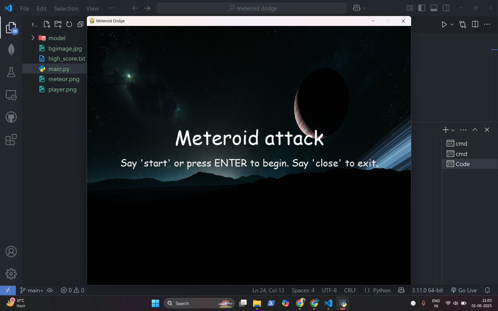
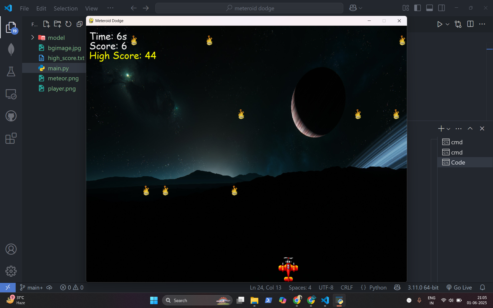
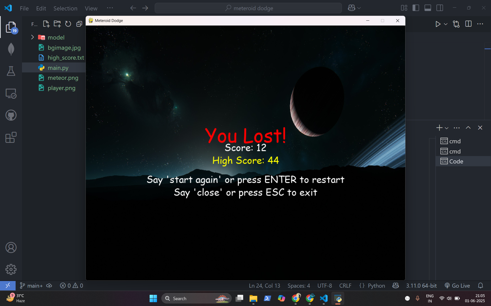

# 🛸 Meteroid Dodge
A voice-controlled arcade game built with **Python**, **Pygame**, and **Vosk**. You dodge falling meteors by speaking commands like **"left"**, **"right"**, and **"stop"**. Start and restart the game using **voice or keyboard**, and track your high score!

## download game from here
[Download here](https://drive.google.com/uc?export=download&id=1YgLKGR-kLKZzVZVwE5OQJnDEaF4gLNlF)

## ▶️ How to Run

### 1. Clone the Repo
- git clone https://github.com/siddhantsaxena/meteroid-dodge.git
- cd meteroid-dodge

### 2. Install Dependencies
pip install pygame sounddevice vosk

### 3. Add Vosk Model
- Download from: https://alphacephei.com/vosk/models
- Extract to the `model/` folder
- Rename the folder to `model`

### 4. Run the Game
python main.py

## 🎙 Voice Commands

| Command          | Effect                   |
|------------------|---------------------------|
| start            | Begin the game            |
| left             | Move player left          |
| right            | Move player right         |
| stop             | Stop player movement      |
| close            | Quit the game             |
| start again      | Restart after game over   |

Also:
- Press ENTER to start/restart
- Press ESC to quit
- 
 
 
 

## 📄 License
This project is created for learning and demonstration purposes.  
Feel free to use and modify with credit.

Made by **Siddhant Saxena** 🧠💻

